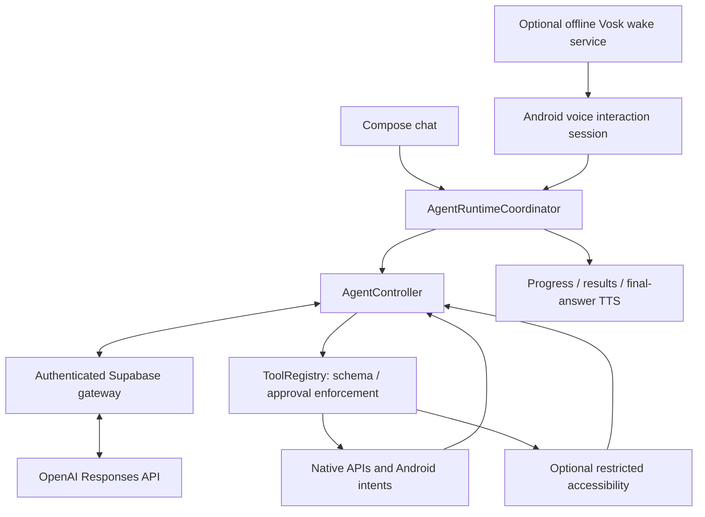

# Project Technical Context

## Purpose

SOL is an Android agent runtime for **Track 04 — Next-Gen Productivity & Automation**. Users express goals through chat or the system assistant. The model chooses registered capabilities; Android validates and executes them.

Current maturity: hackathon technical alpha. See [AUDIT.md](AUDIT.md) for evidence and [GitHub issues](https://github.com/anandh0u/android-solappan/issues) for production work.

## Architecture



There is one agent execution pipeline. Entry surfaces own UI, speech, and approval presentation. The current default model is `gpt-6-astra` with low reasoning effort.

## Components

| Component | Responsibility |
| --- | --- |
| MainActivity | Chat, bounded visible transcript, speech submission, Stop, setup and approval |
| VoiceInteractionService/session | System invocation, persistent assistant panel, speech input/output, explicit close |
| SolWakeWordService | Opt-in microphone foreground service; offline Vosk wake detection |
| AssistantConversation | Last three bounded text turns, session-local, without screenshots or grants |
| AgentRuntimeCoordinator | Convert agent events/results into UI state |
| AgentController | Bounded reasoning/tool loop and cancellation |
| ToolRegistry | Registered names, parameter schema validation, confirmation enforcement |
| AndroidTool implementations | Native intent/API execution and structured results |
| Optional accessibility service | Bounded screen observation/actions through signature-protected app messages |

## Tools

Nine native/intent tools: `list_apps`, `open_app`, `open_maps`, `set_alarm`, `find_contact`, `call_contact`, `prepare_sms`, `search_music`, `control_media`. App discovery uses installed labels, not a package shortcut table. Music uses Android's standard media search/play intent.

Seven optional screen tools: `observe_screen`, `tap_element`, `type_text`, `scroll_screen`, `press_back`, `press_home`, and experimental confirmed `send_message`. The latter checks the observed package, unchanged exact draft, unique visible recipient above it and English Send label; it is not universal semantic recipient verification or delivery proof. Generic tap remains prohibited from sending. Screen tools fail closed on the lock screen.

Call and SMS-draft workflows require approval and open the dialer/draft. Generic tap/type requires approval and rejects sensitive or ambiguous targets. Native APIs remain preferred. Music-intent and media-key dispatch do not prove playback. The development echo tool is no longer exposed by the phone registry. The bounded agent-turn budget is build-configurable (default 24, maximum 40).

## Voice lifecycle

Wake detection uses Vosk Android 0.3.75 and a bundled small English model. It replaces repeatedly restarting Android SpeechRecognizer for wake monitoring. The service has a persistent notification and explicit stop control.

The foreground app and assistant coordinate microphone ownership so wake detection pauses during command recognition and TTS. Assistant responses no longer auto-dismiss the panel. A follow-up listening turn is offered after speech output; silence leaves a manual Talk again action. Close SOL is recognized during active listening. Android may still dismiss/recreate the service due to lifecycle or resource conditions.

Command recognition uses Android's installed provider. TTS speaks the final model answer. Full-duplex realtime audio and durable conversation recovery remain future work.

## State and safety

The shared UI tracks idle, thinking/planning, execution, confirmation, verification, completion, failure, and cancellation. Results expose success, message, data, and an error code. Failed actions must not become success merely because the model later responds.

Protected actions need a user decision and a registry grant. Hiding/destroying the assistant or cancelling work denies pending approval. Cancellation cannot undo an Android action already dispatched.

Screen content is untrusted data. Password filtering and sensitive-label checks reduce exposure but do not provide comprehensive screenshot redaction or semantic assurance across arbitrary apps. Intent acceptance and visible observation are distinct from real-world outcome verification.

## Configuration and release

`local.properties` is Git-ignored and supplies local configuration. Gateway mode excludes the provider key even in debug builds; releases always force gateway mode. The Supabase schema and function are deployed with verified-user/beta access, quotas and continuation ownership. Phone onboarding, privacy/retention qualification, release signing and monitoring remain tracked in GitHub issues. Explicit developer direct mode embeds an extractable key and must not be distributed.

Contact tools return IDs/names rather than raw phone numbers. Explicit screen context can still contain private information. Local clearing does not delete provider-side records.

## Development priorities

Preserve the shared native Android architecture. Prefer native APIs, then intents, then constrained accessibility. Use registered tools only; reject invalid parameters and unknown names. Keep dependencies purposeful, compile frequently, test consequential behavior, and describe validation honestly.

```powershell
.\gradlew.bat testDebugUnitTest assembleDebug lintDebug
```

Final combined validation is recorded in [AUDIT.md](AUDIT.md), while historical decisions and tests remain in [DECISIONS.md](DECISIONS.md) and [ISSUES.md](ISSUES.md).
