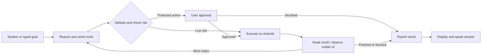

# SOL · Agent Runtime for Android

 Next-Gen Productivity & Automation**

Give SOL a goal. It reasons through the task, chooses registered Android tools, asks for approval when needed, and reports the result.

> “Set an alarm for 7 AM, navigate to GEC Thrissur, and prepare a message to Afnan saying I’ll meet him there.”

Built with Codex, Kotlin, and Android native APIs. The model decides **what should happen**; the runtime decides **what is allowed and how it happens**.

[Demo script](DEMO_SCRIPT.md) · [Submission](SUBMISSION.md) · [Audit evidence](AUDIT.md) · [Roadmap / issues](https://github.com/anandh0u/android-solappan/issues)

## One goal, multiple actions



## The experience

<p align="center"></p>

- **Chat:** a focused SOL conversation, microphone, Send, Stop, and a compact Setup panel.
- **System assistant:** invoke with the Android gesture or SOL Quick Settings tile. SOL stays open after a command; use **Close SOL**, or say “Close SOL” during an active listening turn.
- **Follow-ups:** three recent text turns provide bounded, in-memory context. Screenshots and approval grants are not retained as conversation memory.
- **Voice:** Android recognizes commands; Android TTS speaks final answers. After speech output, the assistant offers a follow-up listening turn. Silence leaves the panel available with **Talk again**.
- **Optional wake phrase:** an offline Vosk listener with a bundled small English model listens for **Hey SOL** while its foreground service is enabled. Microphone ownership is coordinated with chat, assistant listening, and speech output.

Wake behavior is under fresh device validation. It is not an OEM low-power hotword implementation, and continuous use has a battery cost. The gesture and tile remain available.

## Fourteen registered device tools

| Native APIs and intents | Optional screen control |
| --- | --- |
| `open_app`, `open_maps`, `set_alarm` | `observe_screen`, `scroll_screen` |
| `find_contact`, `call_contact`, `prepare_sms` | `tap_element`, `type_text` |
| `search_music`, `control_media` | `press_back`, `press_home` |

Calls open the dialer; messages open drafts. The user performs the final Call or Send action. Spotify search opens results and does not guarantee automatic playback. Screen control requires Android Accessibility consent and varies by app.

## Try a workflow

1. “Open Spotify.”
2. “Search Spotify for Starboy.”
3. “Set an alarm for 7 AM and navigate to GEC Thrissur.”
4. “Prepare a message to Afnan saying I’ll reach 20 minutes late.”
5. Optional screen-control demo: “Open Chrome, observe the screen, tap the address bar, type Solappan agent demo, then observe again. Do not submit.”

The fifth workflow remains a device qualification case; see the [audit](AUDIT.md) before presenting it as a verified demo.

## Run locally

Use Android Studio, JDK 17, Android SDK 35, and an Android 8.0+ device. Physical-device testing is recommended.

Add private configuration to the Git-ignored `local.properties`:

```properties
OPENAI_API_KEY=your_key_here
OPENAI_MODEL=gpt-6-astra
```

The current default is **GPT-6 Astra**, using low reasoning effort. Model availability was checked with a live API request during this audit. The wake engine uses **Vosk Android 0.3.75** with a bundled small English model; command reasoning still requires internet access.

```powershell
.\gradlew.bat testDebugUnitTest assembleDebug lintDebug
```

On the phone, open **Setup**, grant microphone permission, choose SOL as the default assistant, and grant contacts only for contact workflows. Enable screen control only for accessibility tools. Enable Hey SOL explicitly; its persistent notification provides a Stop action.

Release builds deliberately omit the local key; they need a backend before they can reason. **Do not distribute a debug APK containing your API key.** Build-time configuration is for the local demonstration. Public distribution requires an authenticated server gateway and release hardening tracked in [GitHub issues](https://github.com/anandh0u/android-solappan/issues).

## Runtime boundaries

Only registered tools execute. The registry rejects unknown tools and invalid arguments. Protected actions require explicit user approval; screen content cannot grant it. No model-generated code or shell commands run automatically.

Contact lookup returns IDs and display names, keeping raw numbers out of its tool result. Explicit screen context can still contain private visible information. Password filtering is not comprehensive screenshot redaction. Local context clearing does not guarantee provider-side deletion.

Intent acceptance means Android received a request. It does not prove that an alarm was saved, navigation began, or music played. Screen observation verifies visible state, not real-world outcomes.

## Release status

**Hackathon prototype / technical alpha.** The current audit repairs microphone contention, repeated wake activation, assistant lifetime, cancellation, and chat continuity. The combined debug build, 29 unit tests and lint pass; installation and offline wake-engine startup passed on the connected phone. Human spoken and cross-app regression checks remain open; [AUDIT.md](AUDIT.md) records evidence without equating earlier tests with current validation.

Production work includes an authenticated model gateway, OEM/battery qualification, accessibility action assurance, realtime audio, lifecycle persistence, release/privacy qualification, and selected integrations. These are tracked in [GitHub issues](https://github.com/anandh0u/android-solappan/issues).

## Explore the repository

[Architecture](PROJECT.md) · [Product requirements](PRD.md) · [Decisions](DECISIONS.md) · [Validation history](ISSUES.md) · [Judge Q&A](JUDGES_QA.md)

[Third-party notices](THIRD_PARTY_NOTICES.md) · [Official model migration guidance](https://developers.openai.com/api/docs/guides/latest-model/gpt-6-astra)
