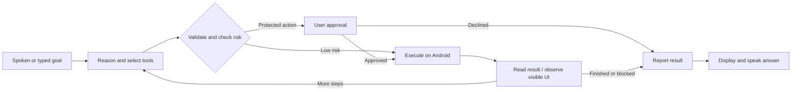

# SOL · Agent Runtime for Android

**Next-Gen Productivity & Automation**

Give SOL a goal. It reasons through the task, chooses registered Android tools, asks for approval when needed, and reports the result.

> “Set an alarm for 7 AM, navigate to GEC Thrissur, and prepare a message to Afnan saying I’ll meet him there.”

Built with Codex, Kotlin, and Android native APIs. The model decides **what should happen**; the runtime decides **what is allowed and how it happens**.

[Demo script](DEMO_SCRIPT.md) · [Submission](SUBMISSION.md) · [Audit evidence](AUDIT.md) · [Roadmap / issues](https://github.com/anandh0u/android-solappan/issues)

Current qualification: the signed-in phone completed a real Supabase gateway → registered app-discovery tool → model continuation round trip with no provider key embedded. The synthetic on-device message test also passed approval, recipient and duplicate-send checks. This is an MVP, not a production-certified release. Real messaging-app compatibility and delivery remain unverified; see the audit for exact evidence and remaining gates.

## One goal, multiple actions



## The experience

<p align="center"></p>

- **Chat:** a focused SOL conversation, microphone, Send, Stop, and a compact Setup panel.
- **System assistant:** invoke with the Android gesture or SOL Quick Settings tile. SOL stays open after a command; use **Close SOL**, or say “Close SOL” during an active listening turn.
- **Follow-ups:** three recent text turns provide bounded, in-memory context. Screenshots and approval grants are not retained as conversation memory.
- **Voice:** Android recognizes commands; Android TTS speaks final answers. After speech output, the assistant offers a follow-up listening turn. Silence leaves the panel available with **Talk again**.
- **Optional wake phrase:** an offline Vosk listener with a bundled small English model listens for **Hey SOL** while its foreground service is enabled. Microphone ownership is coordinated with chat, assistant listening, and speech output.

Wake behavior is under fresh device validation. It is not an OEM low-power hotword implementation, and continuous use has a battery cost. The gesture and tile remain available.

## Sixteen registered device tools

| Native APIs and intents | Optional screen control |
| --- | --- |
| `list_apps`, `open_app`, `open_maps`, `set_alarm` | `observe_screen`, `scroll_screen` |
| `find_contact`, `call_contact`, `prepare_sms` | `tap_element`, `type_text` |
| `search_music`, `control_media` | `press_back`, `press_home` |
| | Experimental `send_message` (explicit approval) |

Calls open the dialer; `prepare_sms` opens drafts. Experimental `send_message` can press a visible English-labelled Send button after approval, checking the app, exact draft and a matching visible recipient above it. It does not prove recipient semantics or delivery across arbitrary apps; WhatsApp end-to-end qualification is still pending. Generic taps cannot send. Music uses Android's standard media search/play intent for a dynamically resolved installed app, with observed UI fallback when unsupported. No playback guarantee is made. Screen control requires Accessibility consent and an unlocked phone.

## Try a workflow

1. “Open Spotify.”
2. “Search Spotify for Starboy.”
3. “Set an alarm for 7 AM and navigate to GEC Thrissur.”
4. “Prepare a message to Afnan saying I’ll reach 20 minutes late.”
5. Optional screen-control demo: “Open Chrome, observe the screen, tap the address bar, type Solappan agent demo, then observe again. Do not submit.”

The fifth workflow remains a device qualification case; see the [audit](AUDIT.md) before presenting it as a verified demo.

## Run locally

Use Android Studio, JDK 17, Android SDK 35, and an Android 8.0+ device. Physical-device testing is recommended.

Add private configuration to the Git-ignored `local.properties`:

```properties
OPENAI_API_KEY=your_key_here
OPENAI_MODEL=gpt-6-astra
USE_GATEWAY=false
```

The current default is **GPT-6 Astra**, using low reasoning effort. Model availability was checked with a live API request during this audit. The wake engine uses **Vosk Android 0.3.75** with a bundled small English model; command reasoning still requires internet access.

```powershell
.\gradlew.bat testDebugUnitTest assembleDebug lintDebug
```

On the phone, open **Setup**, grant microphone permission, choose SOL as the default assistant, and grant contacts only for contact workflows. Enable screen control only for accessibility tools. Enable Hey SOL explicitly; its persistent notification provides a Stop action.

Release builds omit the local key and require the authenticated Supabase gateway. The gateway and SQL migration are deployed; live authentication, access controls, quota enforcement and conversation-isolation smoke tests passed. The current phone build uses gateway mode and also excludes the provider key. Create/verify a SOL beta account in Setup, obtain owner approval and sign in. CLI/dashboard login is not an app account. Device sign-in/refresh and full agent workflows still require qualification. See [gateway setup and privacy boundaries](docs/GATEWAY.md). **Never distribute a developer-mode APK containing a provider key.**

## Runtime boundaries

Only registered tools execute. The registry rejects unknown tools and invalid arguments. Protected actions require explicit user approval; screen content cannot grant it. No model-generated code or shell commands run automatically.

Contact lookup returns IDs and display names, keeping raw numbers out of its tool result. Explicit screen context can still contain private visible information. Password filtering is not comprehensive screenshot redaction. Local context clearing does not guarantee provider-side deletion.

Intent acceptance means Android received a request. It does not prove that an alarm was saved, navigation began, or music played. Screen observation verifies visible state, not real-world outcomes.

## Release status

**Hackathon prototype / technical alpha.** Android has 39 passing unit tests and the gateway has 10 passing local policy/auth tests; debug/instrumentation assembly and lint pass. Hosted gateway smoke tests and a signed-in phone tool round trip passed. The user confirmed unlocked Hey SOL invocation. Synthetic on-device sending passed without contacting anyone; real messaging-app delivery and broader release qualification remain open. [AUDIT.md](AUDIT.md) records the evidence.

Production work includes qualifying signed-in phone workflows, OEM/battery behavior, accessibility action assurance, realtime audio, lifecycle persistence, release/privacy qualification, and selected integrations. These remain tracked in [GitHub issues](https://github.com/anandh0u/android-solappan/issues). CI checks Android compilation/tests/lint, instrumentation-test compilation, release key exclusion and gateway policy/authentication tests. Passing CI is not proof of device or public-release readiness.

## Explore the repository

[Architecture](PROJECT.md) · [Product requirements](PRD.md) · [Decisions](DECISIONS.md) · [Validation history](ISSUES.md) · [Judge Q&A](JUDGES_QA.md)

[Third-party notices](THIRD_PARTY_NOTICES.md) · [Official model migration guidance](https://developers.openai.com/api/docs/guides/latest-model/gpt-6-astra)
