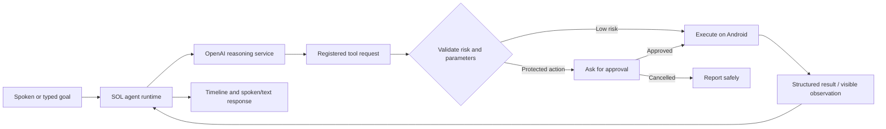
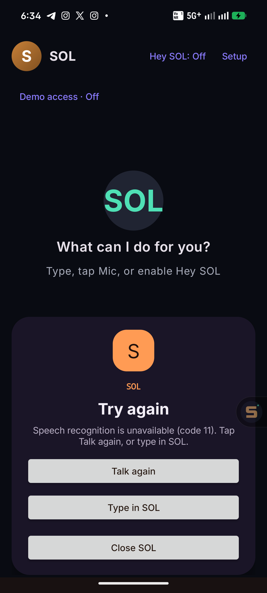

# SOL — Agent Runtime for Android

> A controlled Android agent runtime that turns spoken or typed goals into transparent, tool-driven workflows.

[Watch the recorded demo / pitch video](https://drive.google.com/drive/folders/11loQKqyGb1A48FmHeaw9Y1IQ5X1SPlkI) · [Demo script](DEMO_SCRIPT.md) · [Audit evidence](AUDIT.md) · [Submission notes](SUBMISSION.md) · [Roadmap](https://github.com/anandh0u/android-solappan/issues)

## Overview

SOL is a native Android assistant for completing small, multi-step mobile workflows from one natural-language goal. It accepts text or voice, reasons over a fixed set of Android tools, validates every model-requested action, asks for approval when needed, and reports the result in a visible timeline.

> “Set an alarm for 7 AM, navigate to GEC Thrissur, and prepare a message to Afnan saying I’ll meet him there.”

The model decides **what should happen**. SOL’s Android runtime decides **what is allowed and how it happens**.

## Problem Statement

AI can reason about a goal, but mobile users still manually switch among apps to act on it. A chat response that says “open Maps, set an alarm, and message someone” leaves the repetitive work to the user.

Mobile automation also needs boundaries: an AI model should not receive unrestricted device control, arbitrary code execution, or authority to perform consequential actions without review.

## Solution

SOL turns Android capabilities into registered tools. The model can choose only from tool schemas supplied by the runtime; Android validates tool names and arguments, enforces permissions and confirmations, executes bounded actions, and returns structured results to the model.



There is one shared pipeline for the chat screen, Android assistant gesture, Quick Settings tile, and optional **Hey SOL** wake listener. They are entry points to the same bounded agent—not separate chatbots.

### Safety model

- Only registered tools can execute; unknown tools and invalid parameters are rejected.
- Calls, SMS drafts, and experimental direct message sending require explicit review and approval.
- Generic screen taps cannot approve, call, purchase, send, install, or delete.
- Screen-control tools are optional, require Android Accessibility consent and an unlocked device, and reject password/sensitive targets.
- Android accepting an intent or showing a UI change is not treated as proof of a real-world outcome such as message delivery.

## Features

- **Goal-to-workflow agent:** handles multi-step tool calls with visible thinking, planning, execution, verification, completion, failure, and cancellation states.
- **Android-native actions:** discover/open installed apps, open Maps, create an alarm flow, find contacts, open a dialer, prepare SMS drafts, search music, and control active media.
- **System assistant experience:** invoke SOL from the Android assistant gesture or Quick Settings tile; replies can be spoken with Android TTS and the panel remains open for follow-ups.
- **Voice resilience:** Android speech recognition with retry, a listening watchdog, text fallback, and recovery from Android speech-service disconnects.
- **Optional Hey SOL:** an explicit foreground Vosk listener detects a small set of offline wake phrases and coordinates microphone ownership with command recognition and TTS.
- **Restricted screen control:** optional observation, scroll, Back, Home, tap, and type tools with fresh-target checks and separate consent. Direct cross-app message sending is experimental and always approval-gated.

### Registered tools

| Native Android APIs and intents | Optional restricted screen control |
| --- | --- |
| `list_apps`, `open_app`, `open_maps`, `set_alarm` | `observe_screen`, `scroll_screen` |
| `find_contact`, `call_contact`, `prepare_sms` | `tap_element`, `type_text` |
| `search_music`, `control_media` | `press_back`, `press_home` |
|  | Experimental `send_message` (explicit approval) |

## Tech Stack

- **Frontend:** Kotlin, Jetpack Compose, native Android views for the assistant panel
- **Backend:** Supabase Edge Function gateway (Deno)
- **Database:** Supabase PostgreSQL and Supabase Auth
- **APIs / Services:** OpenAI Responses API, Android intents/native APIs, Android SpeechRecognizer, Android Text-to-Speech, Vosk Android 0.3.75
- **Hosting / Deployment:** Supabase Edge Functions for the authenticated model gateway, GitHub Actions for build/test/lint checks, and an Android APK for the client
- **Other Tools:** Codex, Android Studio, Gradle, GitHub, ADB device testing

## Codex / OpenAI Usage

Codex was used throughout the hackathon for:

- product ideation and agent-runtime architecture planning;
- Kotlin/Compose implementation and registered-tool design;
- debugging Android lifecycle, accessibility, wake-word, and speech-recognition behavior;
- test coverage, build verification, device diagnosis, and repository cleanup;
- README, demo script, audit, and submission documentation.

SOL uses the OpenAI Responses API for reasoning and registered function calls. In gateway mode, requests pass through an authenticated Supabase Edge Function; the Android runtime independently validates every requested tool before it can affect the phone. Release/gateway builds omit provider credentials. Local developer direct mode is available only through Git-ignored configuration and must never be distributed.

## Demo

### Live Demo

SOL is a native Android application, so there is no hosted web UI. The source and build instructions are public at [github.com/anandh0u/android-solappan](https://github.com/anandh0u/android-solappan); build the Android APK using the steps below.

### Demo / Pitch Video

[▶ Watch the recorded SOL demo / pitch video](https://drive.google.com/drive/folders/11loQKqyGb1A48FmHeaw9Y1IQ5X1SPlkI)

The Google Drive folder should remain set to **Anyone with the link can view** for judging. Supplementary repository media: [short UI clip](videos/sol-motion/renders/sol-ui-demo.mp4) · [runtime concept animation](videos/sol-motion/renders/sol-agent-runtime.mp4).

## Screenshots

<p align="center">
  
  
</p>

The first screen is SOL’s focused chat surface. The second is the Android system-assistant panel, which can listen, show the agent timeline, speak results, ask for approval, and remain available for another request.

## How to Run Locally

### Prerequisites

- Android Studio with Android SDK 35
- JDK 17
- An Android 8.0+ device or emulator (a physical device is recommended for assistant, microphone, contact, and Accessibility flows)
- A configured OpenAI project, or access to the deployed Supabase gateway

### 1. Clone the repository

```bash
git clone https://github.com/anandh0u/android-solappan.git
cd android-solappan
```

### 2. Create local configuration

Create a Git-ignored `local.properties` file. Choose one mode:

**Recommended — authenticated gateway mode**

```properties
SUPABASE_URL=your_supabase_project_url
SUPABASE_PUBLISHABLE_KEY=your_supabase_publishable_key
USE_GATEWAY=true
OPENAI_MODEL=gpt-6-astra
```

**Development only — direct provider mode**

```properties
OPENAI_API_KEY=your_openai_api_key
OPENAI_MODEL=gpt-6-astra
USE_GATEWAY=false
```

Never commit `local.properties`, share a provider key, or distribute an APK made with direct provider mode. Release builds force gateway mode and omit the provider key.

### 3. Build and verify

On Windows PowerShell:

```powershell
.\gradlew.bat testDebugUnitTest assembleDebug lintDebug
.\gradlew.bat installDebug
```

On macOS/Linux:

```bash
./gradlew testDebugUnitTest assembleDebug lintDebug installDebug
```

### 4. Configure the phone

1. Open SOL and grant microphone permission.
2. In **Setup**, select SOL as the default Android assistant if you want gesture/tile invocation.
3. Grant Contacts permission only when using contact workflows.
4. Enable screen control only if demonstrating restricted Accessibility tools.
5. Enable **Hey SOL** explicitly if you want the optional foreground wake listener.

## Additional Notes

### Validation

- The final audit records successful Android unit tests, debug/instrumentation assembly, and lint.
- Gateway policy/authentication tests and hosted smoke checks are documented in [AUDIT.md](AUDIT.md).
- Phone evidence includes a signed-in gateway tool round trip, a synthetic approval-gated message-control path, unlocked Hey SOL invocation, and live assistant speech-recognizer startup.

### Limits and next steps

- This is a hackathon MVP / technical alpha, not a production-certified release.
- Calls open the Android dialer and SMS opens drafts. Experimental direct sending does not claim arbitrary-app semantic safety or delivery verification; WhatsApp end-to-end delivery remains unverified.
- Accessibility features require explicit consent and an unlocked device. SOL does not bypass app locks, password screens, Android permissions, or security controls.
- Optional wake behavior is a foreground-service feature, not an OEM low-power hotword guarantee; battery, OEM, background, and lock-screen qualification remain future work.
- If an Android speech service disconnects, SOL keeps the panel open and offers Talk-again/text recovery. A newly reproducible app crash should be captured from the connected device before broader lifecycle changes are made.
- Full-duplex realtime audio, broad integration qualification, privacy/release review, and multi-device validation remain tracked in the [GitHub issues](https://github.com/anandh0u/android-solappan/issues).

For deeper technical detail, see [PROJECT.md](PROJECT.md), [PRD.md](PRD.md), [DECISIONS.md](DECISIONS.md), [AUDIT.md](AUDIT.md), [ISSUES.md](ISSUES.md), and [JUDGES_QA.md](JUDGES_QA.md).

[Third-party notices](THIRD_PARTY_NOTICES.md) · [Official OpenAI model guidance](https://developers.openai.com/api/docs/guides/latest-model/gpt-6-astra)
