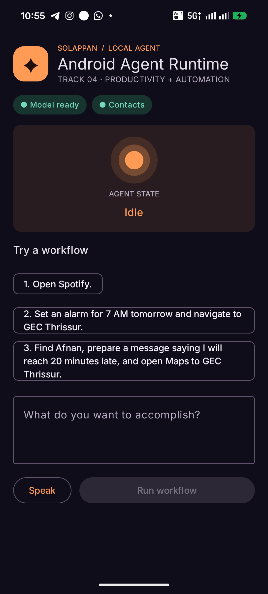

# Solappan — Android Agent Runtime

An agentic mobile automation runtime built for **Track 04 — Next-Gen Productivity & Automation** in a 12-hour Codex hackathon.



Submission materials: [pitch](SUBMISSION.md) · [90-second demo](DEMO_SCRIPT.md) · [judge Q&A](JUDGES_QA.md)

Solappan turns Android into a controlled tool environment for AI. It gives a reasoning model the ability to understand a natural-language goal, create a plan, select registered Android tools, execute actions, verify results, and keep the user in control of consequential actions.

The differentiator is not that a chatbot can open apps. It is that Android capabilities become safe, composable tools for goal-driven automation.

## Core Idea

Traditional mobile AI assistants mainly answer questions or execute predefined commands.

This project explores a more general agent architecture:

**User Goal → Reasoning → Planning → Tool Selection → Android Execution → Verification**

Example:

User:

> "I'm leaving for college. Navigate to GEC Thrissur, set an alarm for 7 AM tomorrow, and prepare a message to Afnan saying I'll meet him there."

Agent:

1. Understand the goal.
2. Generate a plan.
3. Invoke `open_maps()`.
4. Invoke `set_alarm()`.
5. Find the requested contact.
6. Prepare a message.
7. Ask for user approval.
8. Execute the approved action.
9. Report completion.

## Hackathon Objective

Build a reliable working MVP within 12 hours.

The goal is NOT to build a production Android assistant.

The goal is to demonstrate:

- natural-language task understanding
- LLM tool calling
- Android device actions
- multi-step execution
- human approval
- agent progress UI
- basic verification

## Core MVP

The MVP should support:

- Text input
- OpenAI model integration
- Tool/function calling
- Android tool registry
- Open application
- Find contact
- Call/dial contact
- Set alarm
- Open Maps/navigation
- Prepare SMS/message
- Control active media playback
- Agent execution trace
- Confirmation system
- Error handling

## Stretch Features

Only after the core MVP is stable:

- Voice input
- Screenshot understanding
- AccessibilityService
- Tap/type/swipe automation
- UI verification
- Additional Android tools
- Codex-generated capabilities
- Local/on-device models

## Technology

- Kotlin
- Android
- Jetpack Compose
- Coroutines
- Android Intents
- Android Contacts API
- OpenAI API
- Structured tool calling
- Optional Android speech-to-text input with text fallback

## Local Development

Requirements:

- Android Studio with Android SDK 35
- JDK 17
- Android device or emulator

Add the API key to the Git-ignored `local.properties` file:

```properties
OPENAI_API_KEY=your_key_here
OPENAI_MODEL=gpt-5-mini
```

Build with `./gradlew assembleDebug` (`gradlew.bat assembleDebug` on Windows). Never place API keys in committed source files. A direct client key is acceptable only for this local hackathon prototype; a deployed product should use a secured backend proxy.

## Build Philosophy

Reliability is more important than number of features.

Five tools that work every time are better than thirty tools that occasionally work.

## Demo Runbook

Before presenting, connect the phone to the internet, grant Contacts access, and ensure Spotify, Maps, Clock, and Messages are installed. Use these stable prompts:

1. `Open Spotify.`
2. `Set an alarm for 7 AM tomorrow and navigate to GEC Thrissur.`
3. `Find Afnan, prepare a message saying I will reach 20 minutes late, and open Maps to GEC Thrissur.`

The third scenario pauses for explicit approval before opening the SMS draft. Check **I reviewed this action**, then tap **Approve action**. The user must still press Call or Send in the corresponding Android application.

The **Speak** button uses Android's system speech recognizer to fill the same goal field. It does not create a separate voice-agent execution path and never runs a recognized goal automatically.

When Solappan is selected as Android's digital assistant, invoke it by long-pressing the power button or tapping the **SOL** Quick Settings tile. The tile opens the same temporary assistant session and does not run a second agent pipeline. A custom always-listening wake word is not part of the current build.

The optional `control_media` tool sends native Android media commands (`play`, `pause`, `next`, or `previous`) to the active media session. It does not automate Spotify's UI.
